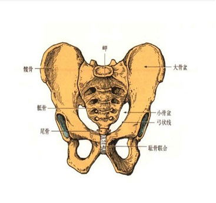
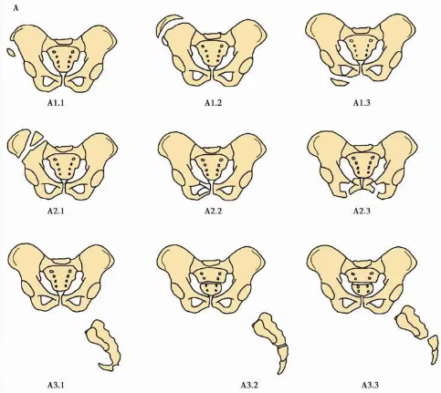
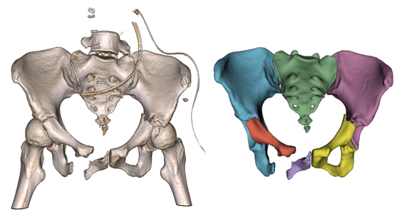
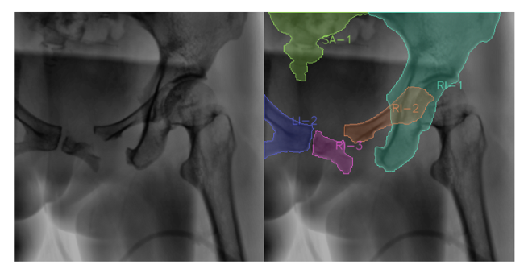

# 面向精准骨外科手术的多模态医学图像分析算法及系统

## （一）研究目的

盆骨骨折不仅破坏了盆骨的结构，还可能导致内脏器官损伤和高死亡率。准确的诊断和及时的手术干预至关重要。我们的研究目的包括开发和应用先进的图像分割技术，提高3D CT扫描和2D X射线图像中盆骨骨折的识别和分析精度，从而优化手术计划和干预策略。

我们还希望基于我们的研究成果，开发一个集成度高的软件平台，结合图像分割算法和临床数据，帮助医生进行盆骨骨折的诊断和治疗决策，同时为骨科机器人提供更准确的骨折定位和解剖结构信息，有助于机器人系统规划和执行手术过程。该系统将提供直观、全面的图像诊断结果和辅助决策工具，提升盆骨骨折治疗的效果与效率。

## （二）研究背景

盆骨是连接脊柱和下肢的重要结构，在维持身体稳定和保护腹部内脏器官等方面
起着至关重要的作用。根据基本的数据统计以及流行 病学调查，盆骨骨折占据全身骨折疾病的 3%，病死率高达16%，且开放性骨折者病死 率可高达24%。因此，及时、准确的诊断和治疗对于提高患者的存活率和生活质量至关重要。

由于骨折骨块的形状无法预测，不同类型的骨折块差异很大，很难根据先验知识进行分割。因此，我们的首要的研究内容是常见盆骨损伤类型，基于损伤类型来实现对盆骨的精准定位。如图，为正常成年人的基本盆骨示意图。而目前主要的盆骨损伤主要集中在大盆骨、髋骨、耻骨这几个部位。

为实现对盆骨的精准定位，我们采用目前主流的盆骨骨折分类AO分型，对盆骨骨折进行分类。综合了损伤机制以及盆骨的稳定程度，把盆骨旋转、垂直稳定性、损伤部位、后方脱位情况及损伤机制作为分类依据。我们计划利用AO分型来辅佐我们的图像分割，以达到更为精确的分割效果。

如图2，为AO分型中通过损伤部位来进行的分类。例如，图A2.1中主要发生了髂骨骨折，相关智能模型对于该盆骨骨折类型，来实现盆骨与其它不相干骨骼的分离。

近年来，卷积神经网络（CNN）在医学图像分割中取得了显著的效果，但解决包含组织、肌肉、骨等解剖特征的三维重建仍具有挑战性。由于医学标记数据集的获取困难，训练一个效果良好的盆腔CT分割模型通常需要大规模高质量的像素级注释数据集。而现有的数据集中的样本数量限制了训练网络的复杂性，可能导致模型的过拟合问题。

为了克服这些挑战，我们计划利用多模态模型进行分析，多模态分割模型可以对盆骨发生损伤的患者的3D CT扫描以及2D X射线扫描图像中的盆骨进行高精确度的分割。相较于单模态的处理，多模态提供了更全面，更丰富的特征描述，同时减轻单模态方法的数据不足或噪声干扰对结果的影响，提高系统的稳健型与鲁棒性。3DCT 扫描对于骨折分型、骨折复位术前计划和螺钉固定计划至关重要；对于2D X 射线图像，通过配准将手术计划转移到手术室方面起着至关重要的作用。通过整合多模态信息，我们可以更好的捕获盆骨结构的形态与特征，从而提高了临床诊断的准确性，更好地指导治疗方案的制定。

## （三）研究内容

我们的研究旨在开发与应用先进的图像分割技术，以提高对盆骨骨折的识别和分析精度，并结合临床数据，优化手术计划和干预策略，从而提高患者的治疗效果和生存率。具体而言，我们的研究包括了以下几个方面：

1. 盆骨骨折分类和定位： 我们采用主流的盆骨骨折分类AO分型，综合损伤机制。   和盆骨稳定程度，以实现对盆骨骨折的准确分类和精准定位。
2. 图像分割技术的开发与应用：我们将利用具有2D标签的X射线图像，结合卷积神经网络（CNN）如U-Net以及U-Net的一系列改进模型等先进技术，提高盆骨CT图像的解剖结构分割精度，为手术图像提供指导。
3. 多模态分割模型的构建：我们计划利用多模态模型进行分析，综合利用不同数据源的信息，提高对盆骨骨折的分割精度。通过融合X射线图像和CT图像的信息，更准确地捕捉解剖结构。
4. 实时导航和手术辅助：
   基于精准的骨折定位和解剖结构信息，我们将探索如何为骨科机器人提供实时导航和手术辅助，以提高手术效率和安全性。
5. 集成的软件平台开发：我们还将开发一个集成度高的软件平台，结合图像分割算法和临床数据，帮助医生进行盆骨骨折的诊断和治疗决策。该系统将提供直观、全面的图像诊断结果和辅助决策工具，提升盆骨骨折治疗的效果与效率。

通过以上研究内容的实施，我们期望为盆骨骨折的诊断和治疗提供更准确、更有效的支持，促进患者的康复和生存。

## （四）国内、外研究现状和发展动态

CT分割已被证明是临床诊断和手术规划的一个重要步骤，因为它保留了实际的解剖结构特征。二维横截面 CT 用于诊断存在的一个问题是，各种形式的骨折通常伴有形状任意、数量不定的骨碎片，外科医生将 CT 切片信息转移到患者特定的解剖形态上的是一个复杂认知计算过程。

为了解决这一问题，研究者们提出了许多分割方法。现有分割骨折盆骨CT 的传统方法大多使用简单的阈值法、区域生长法以及手工制作的模型。Fornaro 等人[1]提出了皮质骨的自适应阈值分割和松质骨的局部生长方法，这种方法依赖于对强度阈值的仔细调整。然而，暴露在碎片边缘的骨小梁骨通常与周围的软组织具有相似的强度。Lai 等人[2]在预处理后的 CT 图像上学习生长的三维区域，Lee 等人[3]将区域增长方法扩展到同时求解多个标签的分割方法。基于区域的方法的缺点是，它需要根据专家的建议来初始化“种子点”。Shadid 等人[4]提出了一种基于骨强度分布的先验估计概率分水岭变换方法，这种技术经常有过度分割的现象。Kennedy 等人[5]采用基于纹理的聚类方法选择盆腔 CT 图谱，但该方法对噪声和强度分布不均匀性敏感。这些传统方法依赖于盆骨结构与周围组织的密度差异，然而，由于皮质骨和小梁骨之间的密度差异小而具有有限的准确性，并且小梁骨在纹理和 CT 强度方面与周围组织相似，如果存在骨折会进一步导致边缘不清晰。因此，这类传统的方法在实际临床应用中存在诸多限制。

深度学习方法已迅速成为医学图像自动分割领域的最新技术并应用于盆骨 CT 分割。Belal 等人[6]提出使用 CNN 框架检测解剖标志，并使用 46 个 CT 体训练形状模型分割人体49 块体骨，报告显示骶骨的平均相似系数（Dice Similarity Coefficient，DSC）为 88%。该方法利用第一个训练好的地标对形状模型进行约束，减少了肋骨间局部特征相似性对网络的影响，从而提高了分割精度。Liu 等人[7]基于 3D U-Net对 208 张核磁共振（Magnetic Resonance，MR）图像进行分割，设计了一个利用位置注意模块和增强通道注意的双注意模块，并开发了一个融合位置和通道图、融合低级特征和高级注意力特征的特征融合模块，以提高髋关节骨结构边缘分割的准确性。Heinrichs[8]认为在 3D 重建中包含更多解剖细节对临床具有重要性，然而，上述方法只包含了骨块的分割，不能满足盆骨 CT 对软硬组织分割的临床要求，这限制了它们的应用场景。此外，目前的有限元建模方法不仅耗时，而且具有不可重复性。深度学习具有较强的学习能力、泛化能力和效率，可以解决盆腔解剖分割的要求[9]。

为了进一步分割复杂的肌肉、组织和骨骼等解剖结构，Hemke 等人[10]将 200 个预处理后的盆腔三维CT 体输入到 U-Net 网络，并将每张 CT 切片注释为五个类别：皮下脂肪组织、肌肉、肌肉间脂肪组织、骨骼和其他盆内内容，这五个类别的平均骰子得分约为 94%。严等人[11]提出了基于U-Net 的尺度和切片感知模型，通过提取大规模类别的空间信息和小规模类别的语义信息解决密集分割盆解剖结构的问题，这个工作将盆骨骨和肌肉分为 54 个类别，并使用平均切片为 20 的 27 个三维 MR 图像的作为训练数据集，结果表明，平均 DSC 和交并集联合（Intersection Over Union，IoU）分别为74.9%和 63.6%。上述基于深度学习方法的成功，依赖于大量带标签的训练数据，来缓解过拟合导致的次优性能，并确保测试集上可靠的泛化性能[12]。

> 参考文献：
>
> [1]Fornaro J, Szekely G,
> Harders M. Semi-automatic segmentation of fractured pelvic bones for surgical
> planning[C]. Biomedical Simulation: 5th International Symposium, ISBMS, 2010,
> 82-89.
>
> [2]Irwansyah, Lai J Y,
> Y, Essomba T, et al. Algorithm for segmentation and reduction of fractured
> bones in computer-aided preoperative surgery[C]. Proceedings of the
> 3rdInternrnational Conference on Biomedical and Bioinformrmatics Engineering,
> 2016, 12-18.
>
> [3]Lee P Y, Y, Lai J Y,
> Y, Hu Y S, et al. Virtual 3D planning of pelvic fracture reduction and implant
> placement[J]. Biomedical Engineering: Applications, Basis and Communications,
> 2012, 24(3): 245-262.
>
> [4]Shadid W G, Willis A.
> Bone fragment segmentation from 3D CT imagery[J]. Computerized Medical Imaging
> and Graphics, 2018, 66: 14-27.
>
> [5]Kennedy A, Dowling J,
> Greer P B, et al. Similarity clustering-based atlas selection for pelvic CT
> image segmentation[J]. Medical Physics, 2019, 46(5): 2243-2250.
>
> [6]Belal S L, Sadik M,
> Kaboteh R, et al. Deep learning for segmentation of 49  selected bones in CT scans: First step in
> automated PET/CT-T-based 3D quantification of skeletal metastases[J]. European
> Journal of Radiology, 2019, 113: 89-95.
>
> [7]Liu X, Han C, Wang H,
> et al. Fully automated pelvic bone segmentation in multiparameteric MRI using a
> 3D convolutional neural network[J]. Insights intoImaging, 2021, 12(1):
> 1-13.
>
> [8]Heinrichs W L,
> Srivastava S, Dev P, P, et al. LUCY: A 3-D pelvic model for surgical simulation[J].
> Journal of the American Association of Gynecologic Laparoscopists, 2004, 11(3):
> 326-331.
>
> [9]Litjens G, Kooi T,
> Bejnordi B E, et al. A survey on deep learnrning in medical image analysis[J].
> Medical Image Analysis, 2017, 42: 60-88.
>
> [10]Hemke R, Buckless C
> G, Tsao A, et al. Deep learning for automated segmentation of pelvic muscles,
> fat, and bone from CT studies for body composition assessment[J]. Skeletal
> Radiology, 2020, 49(3): 387-395.
>
> [11]Yan Y C, Lu J J,
> Chen K, et al. Scale- and slice-aware net (S(2)aNet) for 3D segmentation of
> organs and musculoskeletal structures in pelvic MRI[J]. Magnetic Resonance in
> Medicine, 2022, 87(1): 431-445.
>
> [12]Ukai K, Rahman R,
> Yagi N, et al. Detecting pelvic fracture on 3D-CT using deep convolutional
> neural networks with multi-orientated slab ab images[J]. Scientific Reports,
> 2021, 11(1): 1-11.

## （五）项目创新点

研究创新点：

1. 利用AO分型判断骨碎片的位置：我们将借鉴AO分型的判断方法，通过对盆骨骨折进行分类，实现对骨碎片位置的更精确的定位。通过分析骨折类型和碎片位置，我们能够更准确地识别和定位盆骨骨折，为分割模型提供更精准的标注信息，从而提高图像分割的准确性和可靠性。
2. 多模态图像分割技术的应用： 我们将首次尝试利用多模态图像（包括X射线和CT图像）进行盆骨骨折的分割，通过综合利用不同数据源的信息，并利用我们训练的模型，同时对CT图像和X射线图像进行图像分割的处理，争取为盆骨骨折的诊断和治疗提供更全面的支持。
3. 集成度高的软件平台开发：我们将开发一个集成度高的软件平台，结合图像分割算法和临床数据，为医生提供直观、全面的图像诊断结果和辅助决策工具。这一平台将大大提高盆骨骨折诊断和治疗决策的效率和准确性，为患者提供更好的治疗方案。
4. 实时导航和手术辅助系统的探索： 我们将探索如何基于精准的骨折定位和解剖结构信息，为骨科机器人提供实时导航和手术辅助，以提高手术效率和安全性。这一创新点有望为骨科手术带来新的技术突破和进步。

通过以上创新点的实现，我们的研究将为盆骨骨折诊断和治疗领域带来重要的技术创新和进步，为患者的康复和生存提供更好的支持和保障。

## （六）技术线路、拟解决的问题及预期成果

### 一、技术路线

我们计划结合以下技术和方法来实现盆骨骨折分割自动化：

1. 数据增强和预处理：对已有的半自动标注的2D X射线图像数据集进行数据增强和预处理操作，包括去除噪声、标准化图像大小和方向等，以提高网络的鲁棒性和准确性。
2. AO分型的学习和应用：我们将学习和理解AO分型对盆骨骨折的分类方法，并将其应用于我们的研究中。通过AO分型，我们可以更精确地判断骨碎片的位置，为图像分割提供更精准的标注信息。
3. 多模态图像分割模型的构建：我们将实现一个多模态图形分割模型，同时用于处理3D CT扫描和2D X射线图像。该模型将有基于卷积神经网络（CNN）的深度学习模型构成，通过综合不同数据源的信息，提高图像分割的准确性和鲁棒性。
4. 软件平台的开发和集成：我们将开发一个集成度高的软件平台，将图像分割算法和临床数据集成其中。力争提供直观、全面的图像诊断结果和辅助决策工具，帮助医生进行盆骨骨折的诊断和治疗决策，提高诊断和治疗的准确性和效率。
5. 模型评估和验证：我们将使用收集的数据对我们的多模态图像分割模型进行训练和验证，并通过实验评估其性能，我们将比较不同的模型分割结果，并于人工标注的结果进行对比，以验证我们的方法的有效性和准确性。

### 二、拟解决的问题

我们的研究旨在解决以下问题：

1.盆骨骨折的精准诊断：盆骨骨折的诊断对于治疗至关重要，但由于盆骨结构复杂，骨折形态多样，常常存在诊断误差。我们的研究旨在开发高精度的图像分割技术，实现对盆骨骨折的精准诊断，减少诊断错误和漏诊的发生。

2.平台开发和集成度问题：我们将开发一个集成度高的软件平台，结合图像分割算法和临床数据，为医生提供直观、全面的图像诊断结果和辅助决策工具。我们将解决平台集成度的问题，确保平台能够实现对当前图像的方向、受伤情况等进行准确判断，并为医生提供可靠的辅助决策。

3.数据存储问题：我们将解决大规模医学图像数据的存储和管理问题，确保数据的安全性和可靠性。我们将设计高效的数据存储方案，以应对大规模数据的存储需求，并确保数据的快速检索和访问。

通过解决以上问题，我们的研究将为盆骨骨折的诊断和治疗提供更准确、更有效的支持，促进患者的康复和生存。

### 三、预期成果

通过本项目的研究和实施，我们期望达到以下成果：

1. 高精度的盆骨骨折诊断技术：我们开发出一套高精度的图像分割算法，能够实现对盆骨骨折的精准诊断，提高诊断的准确性和可靠性。
2. 集成度高的软件平台：我们将开发一个集成度高的软件平台，结合图像分割算法和临床数据，为医生提供直观、全面的图像诊断结果和辅助决策工具，提高盆骨骨折诊断和治疗的效率和准确性。
3. 实时导航和手术辅助系统：我们将探索如何为骨科机器人提供实时导航和手术辅助，以提高手术成功率和患者的治疗效果。

科研论文：我们希望可以通过我们的研究成果在相关领域发表一篇论文。

## （七）项目研究进度安排

目前我们还在起步阶段，已初步了解现有医学图像分割和盆骨骨折分割技术及方法，明确研究方向，即推动自动盆骨骨折分割技术的发展，提高其准确性和鲁棒性。我们计划在今后的一段时间内深入学习相关技术，处理盆骨骨折分割的考虑因素。

2024.5-2024.6

这个阶段我们通过搜寻文献以及相关资料，在导师的带领下了解相关技术，进行初步的学习并确定研究方向。

2024.6-2024.9

尝试复现相关论文的研究成果，进一步了解目前盆骨骨折分割技术的技术要点，以及局限性。

2024.9-2025.1

根据尝试过程中遇到的问题以及技术难点，根据导师指引尝试解决并找出更好的处理方式，并且进行自己的模型训练。

2025.1-2025.5

根据模型训练结果撰写论文。

## （八）已有基础

 1．与本项目有关的研究积累和已取得的成绩

（1）小组成员掌握python语言的使用以及pytorch的基本操作。

（2）小组成员通过网络上的资源和书本，对基本的机器学习和深度学习有了一定程度上的了解和认知。

（3）部分小组成员曾参加美国大学生数学建模竞赛（Mathematical Contest in Modeling）并获得H奖（Honorable Winner），有基本的文献搜索能力以及信息处理能力。

目前参考国内外针对骨折盆骨CT图像处理有以下几篇相关论文：

> 1.廖晓蓝. 基于骨折盆骨CT图像的双向约束半监督分割算法研究[D]. 广西:广西大学,2023.
>
> 2.王枫. 基于改进卷积神经网络的医学图像分割方法研究[D]. 四川:四川大学,2021
>
> 3.王飞翔, 姬锐, 张鹿鸣, 王鹏, 刘太昂, 宋鲁杰, 汪茂文, 周智露, 郝虹霞, 夏文涛. 基于数据挖掘算法的盆骨损伤判别模型. 法医学杂志[J], 2022, 38(3): 350-354
> 4.Ukai K, Rahman R, Yagi N, Hayashi K,
> Maruo A, Muratsu H, Kobashi S. Detecting pelvic fracture on 3D-CT using deep
> convolutional neural networks with multi-orientated slab images. Sci Rep. 2021
> Jun 3;11(1):11716. doi: 10.1038/s41598-021-91144-z. PMID: 34083655; PMCID:
> PMC8175387.
>
> 5.Liu, Y. et al. (2023). Pelvic Fracture Segmentation Using a Multi-scale Distance-Weighted Neural Network.
> In: Greenspan, H., et al. Medical Image Computing and Computer Assisted
> Intervention – MICCAI 2023. MICCAI 2023. Lecture Notes in Computer Science, vol
> 14228. Springer, Cham.
>
> 6.Cheng, Chi-Tung, Yirui Wang, Huan-Wu Chen, Po-Meng Hsiao, Chun-Nan Yeh,
> Chi-Hsun Hsieh, Shun Miao, Jing Xiao, Chien-Hung Liao, and Le Lu. "A
> scalable physician-level deep learning algorithm detects universal trauma on
> pelvic radiographs." Nature communications 12, no. 1 (2021): 1066.

2．已具备的条件，尚缺少的条件及解决方法

  已具备的条件：

1. 医学图像数据集：我们有一个来自多个机构使用各种扫描设备收集的150名患者的CT扫描数据集，此外，该数据集使用了DeepDRR方法从CT数据生成了高质量、逼真的X射线图像和相应的2D标签，可用于训练模型，为研究提供了必要的数据支持。
2. 深度学习技术：目前有许多深度学习图像分割网络框架，如FCN，DeconvNet,DeepLab,U-Net,V-Net等，可以作为实验的基础。
3. 实验平台和硬件设备：拥有一个 Nvidia RTX 4070 12G显存显卡作为训练平台。

尚缺少的条件及解决方法：

深度学习算法的选择：目前我们尚未明确哪种图像分割算法来处理盆骨骨折图像的效果最优。为了解决这个问题，我们计划进行一系列的实验和比较，评估不同算法在这一任务上的性能表现。这将包括尝试各种经典和最新的图像分割技术，以及调整它们的参数以获得最佳结果，接着再在此基础上进行创新，争取探索出一个更具有精确性的算法。我们也将考虑到数据集的特点和医学领域的知识，以确保所选算法能够有效地应用于盆骨骨折图像的分割任务。
